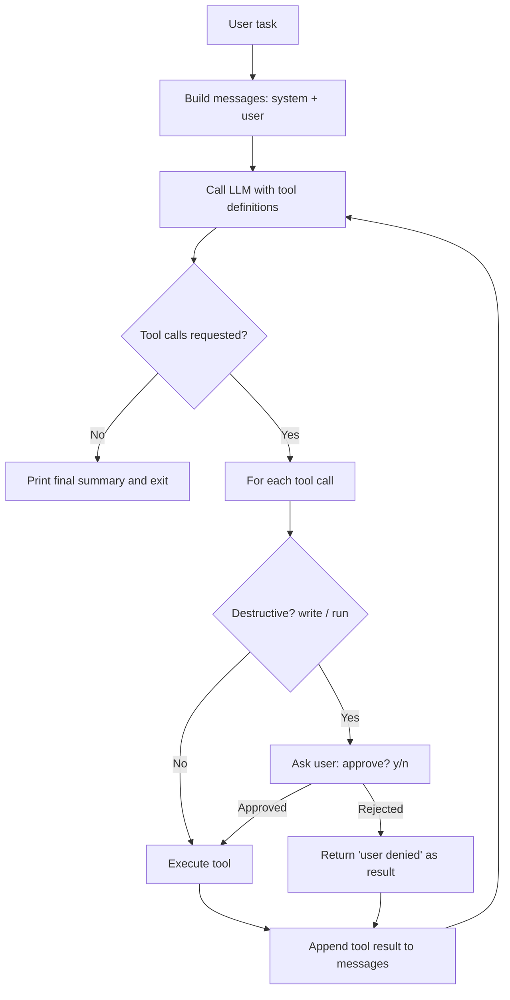

# SimpleCursor — Build Spec (Implementation Brief)

> **Audience: the coding agent implementing this.** Your task is to BUILD **SimpleCursor**, a ~350-line agentic coding assistant. Its purpose as an artifact is to make the core concepts of Cursor-style agent mode **observable in its terminal output**. This document is the build contract: requirements, interfaces, and verification. Build to this spec and do not add scope beyond it.

---

## 1. Product Goal

Deliver a single-file Python CLI, `simplecursor.py`, that behaves as a minimal agentic coding assistant: it accepts a natural-language task, lets an LLM drive tools to inspect and
edit files in the working directory, and loops until the task is complete.

The artifact is a teaching aid, so the success metric is **clarity, not features**: the source must be readable in one sitting, and the runtime trace must make the five concepts in
§4 visible. When forced to choose, favor an obvious control flow over cleverness, abstraction, or performance.

---

## 2. Target Environment & Dependencies

- **Language:** Python 3.10+; use type hints throughout.
- **Dependencies:** the Python standard library **plus one** LLM SDK, `openai`. No other third-party packages, no web framework, no database, no telemetry.
- **Auth:** support GitHub Models through `GITHUB_TOKEN` and OpenAI through `OPENAI_API_KEY`. Prefer GitHub Models when both are set. If neither is set, exit immediately with a clear, actionable message.
- **Model:** default to `gpt-5` for OpenAI and `openai/gpt-5` for GitHub Models, keeping both values in constants near the top of the file. Allow a provider-compatible model ID to be selected with `--model`.
- **Portability:** must run on Windows, macOS, and Linux. Use `pathlib`/`os.path` for paths; in `run_command`, note the `shell=True` injection risk in a comment.

---

## 3. Deliverables & Project Layout

Produce these required runtime files:

```
simplecursor.py       # the entire agent (~350 lines, single file)
README.md             # setup + run instructions (see §10)
requirements.txt      # a single line: openai
sample/
    hello.py          # a tiny file the smoke test (§12) reads and edits
```

Supporting repository files such as `LICENSE` and this specification may also be present. Keep all runtime logic in `simplecursor.py` so a reader can follow the whole system top to bottom. Do not introduce additional runtime modules, packages, or config files.

---

## 4. Functional Requirements — Observable Concepts

The build is correct only if these five concepts are **visible in stdout** at runtime. Each row is a hard requirement, not a suggestion.

| # | Concept | Required runtime behavior |
|---|---------|---------------------------|
| 1 | Agent loop | Print a step header for each iteration (`Step 1`, `Step 2`, …). |
| 2 | Tool calling | Print every tool name + JSON arguments **before** executing it. |
| 3 | Context gathering | The system prompt must drive the model to read/list/search before editing. |
| 4 | System prompt | Printable on demand via `--verbose` (see §8). |
| 5 | Human-in-the-loop | Prompt `approve? [y/N]` before any destructive tool call (see §11). |

---

## 5. Architecture

SimpleCursor is a single-process CLI. The user gives a natural-language task; the model requests tool calls; the program executes them and feeds the results back; the loop repeats
until the model returns a final answer with no tool calls.



**Implementation note:** the LLM is stateless between calls. All conversation memory must live in one `messages` list that the program appends to every turn — both the model's tool-call requests and the tool results. Do not rely on any server-side state.

---

## 6. Module Contract (required interfaces)

Implement at least the following. Treat the signatures as the contract and keep the names stable, because the verification steps in §12 rely on them.

```python
# Tools: each returns a plain str (the tool result the model consumes).
def read_file(path: str) -> str: ...
def list_dir(path: str) -> str: ...
def search(query: str, path: str = ".") -> str: ...
def write_file(path: str, content: str) -> str: ...   # destructive
def run_command(command: str) -> str: ...             # destructive

# Registry consumed by the loop.
TOOLS: list[dict]                # JSON schemas advertised to the model
DISPATCH: dict[str, "callable"]  # tool name -> function
DESTRUCTIVE: set[str]            # {"write_file", "run_command"}

# Orchestration.
def execute_tool(name: str, args: dict, auto_approve: bool) -> str: ...
def agent_loop(task: str, *, model: str, max_steps: int, verbose: bool, auto_approve: bool) -> None: ...
def main() -> None: ...           # arg parsing, env checks, entry point
```

Rules for the above:

- Every tool returns a **string**, including on failure (e.g. `"ERROR: <reason>"`). A tool must never raise out to the loop; the agent has to be able to observe and recover.
- `execute_tool` enforces the approval gate for names in `DESTRUCTIVE` unless `auto_approve` is set. A denied action returns `"user denied this action"`.
- `read_file` and `search` truncate output to a sane cap (e.g. first ~4 KB or ~200 matched lines) so large files cannot blow up the context window.

---

## 7. Tool Set

Keep the toolbox minimal but "real enough" to edit a small project. Each tool is a plain Python function plus a JSON schema the model sees.

| Tool | Arguments | Returns | Destructive? |
|------|-----------|---------|:------------:|
| `read_file` | `path` | File contents (truncated if huge) | No |
| `list_dir` | `path` | Names of entries in a directory | No |
| `search` | `query`, `path?` | Matching lines with file:line | No |
| `write_file` | `path`, `content` | Confirmation string | **Yes** |
| `run_command` | `command` | Combined stdout + stderr | **Yes** |

Design rules:

- Tool results are always **strings** (what the model consumes).
- Read-only tools run without approval; destructive tools require it.
- Errors are returned as strings (e.g. `"ERROR: file not found"`), never raised, so the agent can observe failure and recover.
- Confine file operations to the working directory; reject paths that escape it (see §11).

---

## 8. The Agent Loop (behavioral spec)

Reference pseudocode (not final code):

```
messages = [system_prompt, user_task]
for step in 1..MAX_STEPS:
    response = llm(model, messages, tools)
    append response to messages
    if response has no tool calls:
        print final content; stop
    for each tool_call in response:
        print step, tool name, arguments        # visibility (req. §4.2)
        result = execute_tool(name, args, auto_approve)
        append tool result to messages           # memory grows here
```

Requirements:

- `max_steps` defaults to 15; if exceeded, stop and print a clear notice (guards against runaway loops).
- Every tool call is echoed **before** execution.
- The final turn (a response with no tool calls) is printed as the summary to the user.
- With `--verbose`, also print the system prompt once at startup and each newly added message body once.

---

## 9. System Prompt

Short and explicit. It must instruct the model to:

- Work in small steps, using tools rather than guessing file contents.
- Gather context (read/list/search) before editing.
- Propose a single `write_file`/`run_command` at a time.
- Stop and summarize when the task is complete.

Reference draft (tune as needed):

> "You are Cursor, a coding agent. Accomplish the user's task using the provided tools, one step at a time. Read files before editing them. Do not invent file contents. When the task is done, stop calling tools and summarize what you changed."

---

## 10. CLI Interface

Expose exactly this interface (the README and the smoke test depend on it):

```
python simplecursor.py "<task in plain English>" [--verbose] [--auto-approve] [--max-steps N] [--model MODEL]
```

| Argument | Required behavior |
|----------|-------------------|
| `<task>` (positional) | The task string. Required; error clearly if missing. |
| `--verbose` | Print the system prompt at startup and each newly added message body once. |
| `--auto-approve` | Skip approval gates (used by the automated smoke test). |
| `--max-steps N` | Override the loop bound (default 15). |
| `--model MODEL` | Override the selected provider's default model. GitHub Models IDs use `publisher/model` format. |

`README.md` must document: installing deps (`pip install -r requirements.txt`), setting either
`GITHUB_TOKEN` or `OPENAI_API_KEY` (show both bash `export` and PowerShell `$env:` forms), provider precedence, and one run example.

---

## 11. Safety Requirements

- **Approval gate:** before any `write_file`/`run_command`, print the exact effect (target
  path plus a short preview/diff of the new content, or the full command string) and require
  an explicit `y`. Treat anything else as denial.
- **Rejection is data:** a denied action returns `"user denied this action"` so the loop
  continues and the agent can adapt instead of crashing.
- **Path confinement:** resolve every file path and reject any that resolves outside the
  current working directory; return an `ERROR:` string rather than raising.
- **No network tools** in v1. The only outbound network call is to the LLM API.

---

## 12. Verification / Smoke Test

Before declaring the build done, verify it against the bundled `sample/` project:

```
python simplecursor.py --auto-approve "Add a greet(name) function to sample/hello.py and print a test call"
```

The trace must contain (order may vary slightly, but all must appear):

1. A `list_dir` or `read_file` call that inspects the project before editing.
2. A `read_file` of `sample/hello.py`.
3. A `write_file` to `sample/hello.py`, echoed before execution.
4. A `run_command` that runs the file, echoed before execution.
5. A final no-tool-call turn printing a plain-text summary.

Also verify **without the network**:

- Each tool function returns a string for both success and failure inputs.
- `write_file`/`read_file` reject a path outside the CWD.
- The approval gate returns `"user denied this action"` on any non-`y` input.

If neither API credential is available in the build environment, still run the non-network checks and document how to run the full smoke test.

---

## 13. Acceptance Criteria

- [ ] `simplecursor.py`, `README.md`, `requirements.txt`, and `sample/hello.py` all exist.
- [ ] The smoke test (§12) completes end-to-end when a key is present.
- [ ] Every tool call is printed before execution.
- [ ] Destructive actions are gated by approval; a denial does not crash the loop.
- [ ] File operations are confined to the working directory.
- [ ] `simplecursor.py` stays within ~350 lines including comments.
- [ ] All five concepts in §4 are demonstrable from stdout.

---

## 14. Line Budget (guidance)

Approximate allocation for the ~350-line target; adjust but stay close.

| Component | ~Lines | Responsibility |
|-----------|:------:|----------------|
| Tool schemas (JSON) | 90 | Describe available actions to the model |
| Tool implementations | 90 | `read_file`, `write_file`, `list_dir`, `search`, `run_command` |
| Agent loop | 55 | Orchestrate act → observe → repeat |
| System prompt | 15 | Shape behavior and stopping rules |
| Approval + output formatting | 35 | Safety gate + visible trace |
| CLI / arg parsing / glue | 50 | Entry point, flags, provider setup |
| Comments / docstrings | 15 | Inline explanation |
| **Total** | **~350** | |

---

## 15. Out of Scope (do NOT build in v1)

Intentionally excluded — do not implement these; instead list them in the README as "what a
production tool adds":

- Streaming responses.
- Diff/patch-based edits instead of whole-file writes.
- Codebase indexing / embeddings retrieval.
- Retries and error recovery on API or tool failures.
- Additional provider plug-in architecture and interactive model-selection UI.
- Parallel tool execution, persistence, managed credential storage, telemetry.
- Editing outside the working directory.
